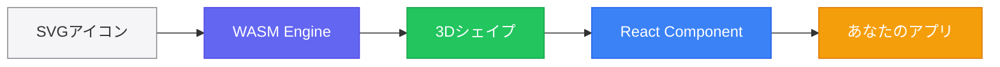
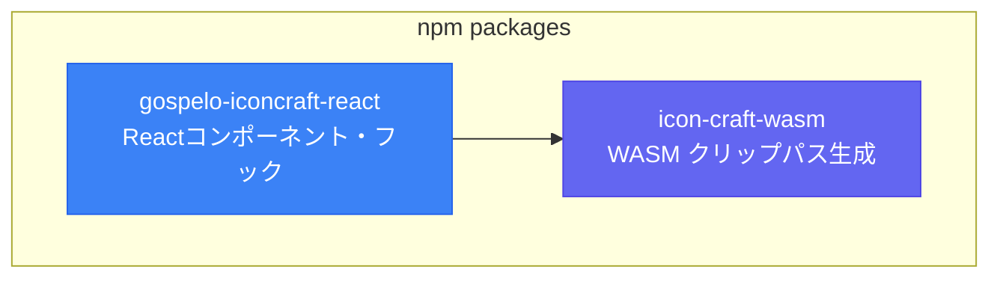
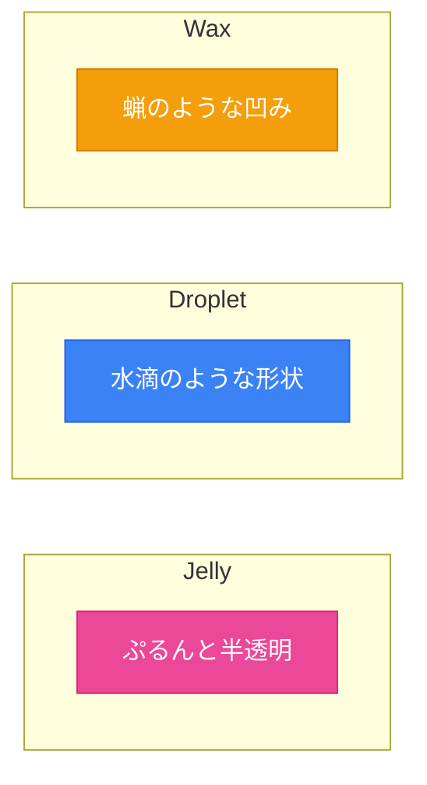
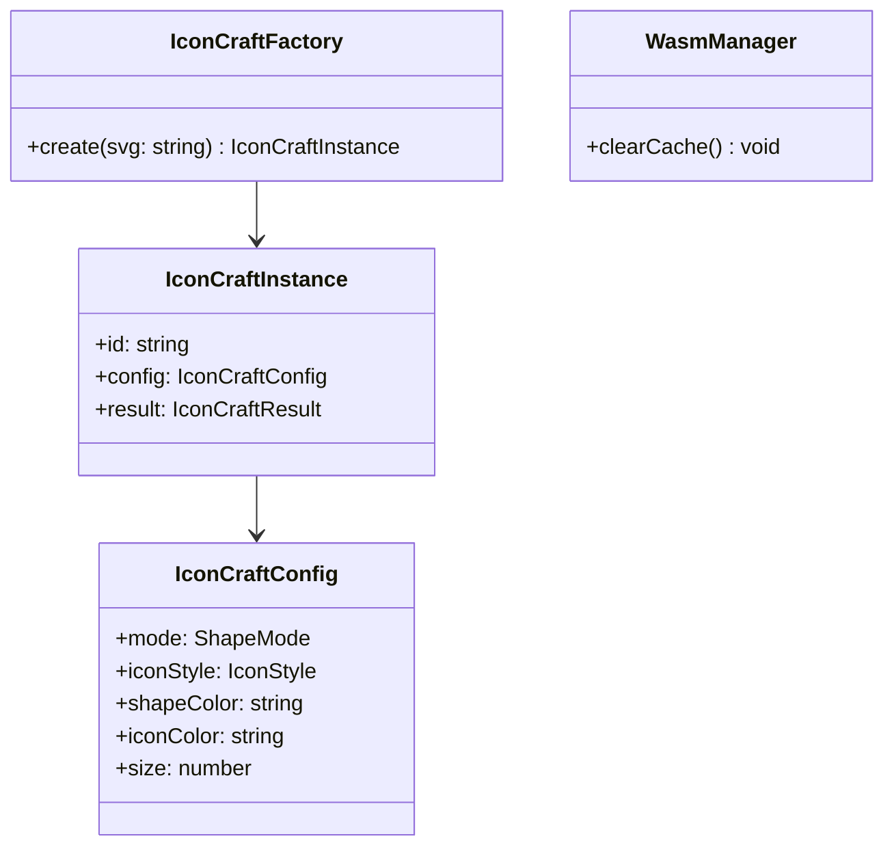
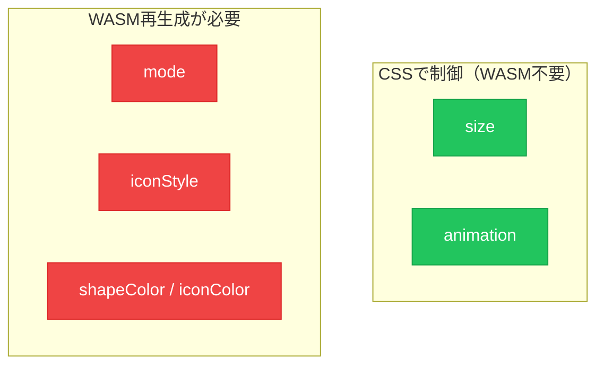
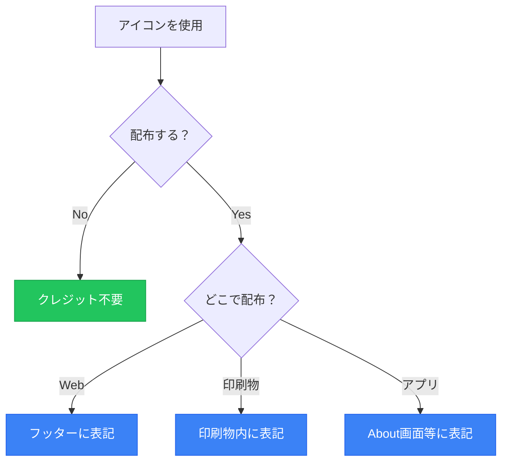

# Gospelo IconCraft

SVGアイコンから3Dスタイルの装飾シェイプを生成するライブラリです。
すべての機能が**MITライセンス**で提供されています。

---

## 概要



| 入力            | 処理                 | 出力           |
| --------------- | -------------------- | -------------- |
| 任意のSVG / URL | Rust WASM で高速処理 | 3D装飾シェイプ |

---

## パッケージ構成



---

## ライブラリ提供範囲

| 区分                          | 機能                        | 説明                                        |
| ----------------------------- | --------------------------- | ------------------------------------------- |
| **ライブラリ提供範囲（MIT）** | シェイプ生成エンジン        | WASM による高速クリップパス生成             |
|                               | React コンポーネント        | IconCraftView, IconCraftShape 等            |
|                               | 状態管理フック              | useIconCraftStore, useIconCraftSelection 等 |
|                               | アニメーション              | float, pulse, bounce 等 17種類 + カスタム拡張 |
|                               | 型定義                      | TypeScript 完全対応                         |
| **個別プロダクトで実装**      | レイアウト / キャンバスUI   | 配置・リサイズ等のUI                        |
|                               | ドラッグ & ドロップ         | アイコンの移動操作                          |
|                               | アイコンカタログUI          | アイコン選択インターフェース                |
|                               | ファイル保存 / エクスポート | PNG, SVG 等の出力機能                       |
|                               | 設定パネルUI                | パラメータ調整インターフェース              |

---

## シェイプモード

3種類の3Dスタイルを生成できます。



| モード    | 説明                     | 特徴                       |
| --------- | ------------------------ | -------------------------- |
| `jelly`   | 半透明でぷるんとした質感 | 透明感のあるグラデーション |
| `droplet` | 水滴のような形状         | 丸みのあるハイライト       |
| `wax`     | 蝋のような凹み形状       | 立体的な陰影               |

---

## アイコンスタイル

| スタイル   | 説明                                     |
| ---------- | ---------------------------------------- |
| `original` | 元のSVG色を保持                          |
| `emboss`   | エンボス加工スタイル                     |
| `stroke`   | アウトライン描画（iconColorで色指定）    |
| `fill`     | 単色塗りつぶし（iconColorで色指定）      |

---

## 基本的な使い方

```typescript
import {
  IconCraftFactory,
  IconCraftView,
  WasmManager,
} from "gospelo-iconcraft-react";

// 1. ファクトリを作成
const factory = new IconCraftFactory({
  mode: "jelly",
  iconStyle: "original",
  shapeColor: "#6366f1",
  size: 120,
});

// 2. インスタンスを生成
const icon = factory.create("https://cdn.example.com/icon.svg");

// 3. コンポーネントで表示
<IconCraftView instance={icon} animation="float" />

// キャッシュクリア（必要に応じて）
WasmManager.clearCache();
```

---

## API リファレンス

### コアクラス



### React コンポーネント

| コンポーネント   | 説明                       |
| ---------------- | -------------------------- |
| `IconCraftView`  | メインの表示コンポーネント |
| `IconCraftShape` | シェイプ表示（レガシー）   |
| `IconCraft`      | 旧API互換コンポーネント    |

### 状態管理フック

```typescript
import {
  IconCraftProvider,
  useIconCraftStore,
  useIconCraftSelection,
  useIconCraftEvent,
  useIconCraftCreate,
} from 'gospelo-iconcraft-react';

function App() {
  return (
    <IconCraftProvider>
      <MyComponent />
    </IconCraftProvider>
  );
}
```

| フック                  | 説明                 |
| ----------------------- | -------------------- |
| `useIconCraftStore`     | ストア管理           |
| `useIconCraftSelection` | 選択状態管理         |
| `useIconCraftEvent`     | イベントハンドリング |
| `useIconCraftCreate`    | アイコン生成         |

---

## アニメーション

CSSキーフレームベースの17種類のビルトインアニメーションを提供。

### ループアニメーション

| アニメーション | 説明             |
| -------------- | ---------------- |
| `float`        | ふわふわ浮遊     |
| `pulse`        | 脈動             |
| `bounce`       | バウンス         |
| `heartbeat`    | 心拍             |
| `spin`         | 回転             |
| `squish`       | ぷにょんと潰れる |
| `wiggle`       | 左右に揺れる     |
| `breathe`      | 呼吸するような   |

### ワンショットアニメーション

| アニメーション | 説明           |
| -------------- | -------------- |
| `shake`        | 震え           |
| `jello`        | ゼリー状の揺れ |
| `wobble`       | よろめき       |
| `swing`        | 振り子         |
| `rubberBand`   | ゴムバンド     |
| `tada`         | 注目を引く     |
| `flip`         | 裏返し         |
| `drop`         | 落下してバウンド |
| `pop`          | ポップイン     |

```typescript
<IconCraftView
  instance={icon}
  animation="float"
  animateOnHover={true}
/>
```

### アニメーションターゲット

アニメーションを適用する対象を指定できます。

| ターゲット | 説明                               |
| ---------- | ---------------------------------- |
| `both`     | 全体をアニメーション（デフォルト） |
| `shape`    | 背景シェイプのみアニメーション     |
| `icon`     | アイコンのみアニメーション         |

```typescript
// アイコンだけ回転させる
<IconCraftView
  instance={icon}
  animation={{ type: 'spin', target: 'icon' }}
/>

// シェイプだけ脈動させる
<IconCraftView
  instance={icon}
  animation={{ type: 'pulse', target: 'shape' }}
/>
```

### カスタムアニメーションの追加

ライブラリを変更せずにカスタムアニメーションを追加できます。

#### 1. 型定義の拡張（TypeScript）

```typescript
// types/iconcraft.d.ts
declare module 'gospelo-iconcraft-react' {
  interface CustomAnimationRegistry {
    tada: true;
    flip: true;
    rotateIcon: true;
  }
}
```

#### 2. アニメーションの登録

```typescript
// setup.ts
import { registerAnimation } from 'gospelo-iconcraft-react';

// Tada アニメーション（全体に適用）
registerAnimation('tada', {
  keyframes: `
    @keyframes iconcraft-tada {
      0% { transform: scale(1) rotate(0deg); }
      10%, 20% { transform: scale(0.9) rotate(-3deg); }
      30%, 50%, 70%, 90% { transform: scale(1.1) rotate(3deg); }
      40%, 60%, 80% { transform: scale(1.1) rotate(-3deg); }
      100% { transform: scale(1) rotate(0deg); }
    }
  `,
  defaults: { duration: 1, iterationCount: 1, timingFunction: 'ease' }
});

// アイコンだけ回転するカスタムアニメーション
registerAnimation('rotateIcon', {
  keyframes: `
    @keyframes iconcraft-rotateIcon {
      0% { transform: rotate(0deg); }
      100% { transform: rotate(360deg); }
    }
  `,
  defaults: { duration: 2, iterationCount: 'infinite', timingFunction: 'linear' },
  transformOrigin: 'icon', // アイコンの中心を基準に回転
});
```

#### registerAnimation オプション

| オプション        | 型                         | 説明                                     |
| ----------------- | -------------------------- | ---------------------------------------- |
| `keyframes`       | `string`                   | CSS @keyframes ルール（必須）            |
| `defaults`        | `AnimationOptions`         | デフォルト設定（duration, iterationCount等） |
| `transformOrigin` | `TransformOriginValue`     | 回転・スケールの基準点                   |

#### transformOrigin プリセット

| プリセット       | CSS値           | 説明             |
| ---------------- | --------------- | ---------------- |
| `'center'`       | `center center` | 中央（デフォルト） |
| `'icon'`         | `center center` | アイコン中央     |
| `'top'`          | `50% 0%`        | 上端中央         |
| `'bottom'`       | `50% 100%`      | 下端中央         |
| `'left'`         | `0% 50%`        | 左端中央         |
| `'right'`        | `100% 50%`      | 右端中央         |
| `'top-left'`     | `0% 0%`         | 左上隅           |
| `'top-right'`    | `100% 0%`       | 右上隅           |
| `'bottom-left'`  | `0% 100%`       | 左下隅           |
| `'bottom-right'` | `100% 100%`     | 右下隅           |

カスタム座標も型安全に指定可能です：

```typescript
registerAnimation('customSwing', {
  keyframes: `...`,
  // 型安全なオブジェクト形式
  transformOrigin: { x: '50%', y: 0 },  // 上端中央
});

registerAnimation('cornerSpin', {
  keyframes: `...`,
  transformOrigin: { x: '25%', y: '75%' }, // カスタム位置
});
```

#### TransformOriginCustom 型

| プロパティ | 型                | 説明                      |
| ---------- | ----------------- | ------------------------- |
| `x`        | `string \| number` | X座標（number=px, string=任意） |
| `y`        | `string \| number` | Y座標（number=px, string=任意） |

#### 3. 使用例

```typescript
// 型安全にカスタムアニメーションを使用
<IconCraftView
  instance={icon}
  animation="tada"
/>

// アイコンだけに適用
<IconCraftView
  instance={icon}
  animation={{ type: 'rotateIcon', target: 'icon' }}
/>
```

---

## 設定オプション

| プロパティ       | 型                 | デフォルト  | 説明               |
| ---------------- | ------------------ | ----------- | ------------------ |
| `mode`           | `ShapeMode`        | `'wax'`     | シェイプモード     |
| `shapeColor`     | `string`           | `'#6366f1'` | シェイプ背景色     |
| `iconColor`      | `string`           | `'#1d1d1f'` | アイコン色         |
| `iconStyle`      | `IconStyle`        | `'emboss'`  | アイコンスタイル   |
| `shadow`         | `boolean`          | `true`      | ドロップシャドウ   |
| `highlight`      | `boolean`          | `true`      | ハイライト効果     |
| `offset`         | `number`           | `20`        | WASMオフセット     |
| `resolution`     | `number`           | `256`       | WASM解像度         |
| `simplify`       | `number`           | `2.0`       | WASM簡略化         |
| `size`           | `number \| string` | `120`       | サイズ             |
| `animation`      | `AnimationType`    | `undefined` | アニメーション     |
| `animateOnHover` | `boolean`          | `false`     | ホバー時のみアニメ |

---

## 動的変更の制約



| 変更項目    | WASM再生成 | 備考                     |
| ----------- | ---------- | ------------------------ |
| `size`      | 不要       | CSSで制御                |
| `animation` | 不要       | CSSで制御                |
| `mode`      | **必要**   | シェイプ形状が変わる     |
| `iconStyle` | **必要**   | レンダリング方式が変わる |
| `shapeColor`| **必要**   | グラデーション再計算     |
| `iconColor` | 条件付き   | stroke/fillスタイル時のみ再生成 |

---

## 型定義

```typescript
import type {
  // シェイプ & スタイル
  ShapeMode, // 'jelly' | 'droplet' | 'wax'
  IconStyle, // 'original' | 'emboss' | 'stroke' | 'fill'

  // アニメーション
  AnimationType, // 'float' | 'pulse' | 'bounce' | ...
  AnimationTarget, // 'shape' | 'icon' | 'both'
  AnimationOptions,
  BuiltInAnimationType,
  CustomAnimationRegistry,

  // カスタムアニメーション
  CustomAnimationDefinition,
  TransformOriginPreset,
  TransformOriginCustom,
  TransformOriginValue,

  // 結果 & 設定
  IconCraftResult,
  IconCraftConfigOptions,
  ColorPalette,
} from "gospelo-iconcraft-react";
```

### アニメーションユーティリティ関数

```typescript
import {
  registerAnimation,     // カスタムアニメーション登録
  getCustomAnimation,    // カスタムアニメーション取得
  getAnimationDefaults,  // デフォルト設定取得
  getKeyframes,          // キーフレームCSS取得
  getTransformOrigin,    // 変形原点取得
  getAnimationName,      // アニメーション名取得
  parseAnimationOptions, // オプションパース
  getAnimationStyle,     // CSSスタイル文字列生成
  injectKeyframes,       // キーフレームをDOMに注入
} from "gospelo-iconcraft-react";
```

---

## アイコン素材の利用規約

> IconCraft自体はMITライセンスですが、**入力するSVGには各素材の利用規約が適用されます**。

### ライセンス早見表

| 素材       | ライセンス   | 商用利用 | クレジット                     |
| ---------- | ------------ | -------- | ------------------------------ |
| Twemoji    | CC-BY 4.0    | 可       | **必須**                       |
| OpenMoji   | CC-BY-SA 4.0 | 可       | **必須**（派生も同ライセンス） |
| Noto Emoji | Apache 2.0   | 可       | **必須**                       |
| 自作SVG    | 制限なし     | 可       | 不要                           |

### クレジット表記例

```
Twemoji by Twitter, Inc. (CC-BY 4.0)
```

### 利用シーン別ガイド



### クレジット不要のケース

- **商用サービスでも、ユーザーのブラウザで生成・表示するだけなら規約違反にならない**
- デモサイトで生成 → 個人のブラウザで表示、デスクトップ壁紙に使用
- 社内プレゼン資料に使用（社外配布しない場合）
- ローカル環境でテスト目的に使用
- 自分のSNSアイコンとして使用（素材自体を再配布しない場合）

> **ポイント**: ブラウザ上でWASMにより生成され、その場で表示されるだけであれば「配布」には該当しません。ユーザーがダウンロードして再配布する時点で初めてライセンス条件が発生します。

### クレジット必須のケース

- チラシ・ポスターに印刷して配布
- Webサイト・アプリにアイコン画像を**埋め込んで**公開（サーバー側で生成・配信する場合）
- PDFで配布

### CDNカタログUI / 商用サービスについて

CDN経由でアイコンを表示するカタログUIや、商用サービスでの利用自体は**規約違反になりません**。

- CDNからの直接参照は再配布ではない
- ユーザーのブラウザで動的に生成・表示するだけなら配布に該当しない
- ユーザーがダウンロード・再配布した時点で初めてライセンス条件が発生

---

## ライセンス

```
MIT License

Copyright (c) gospelo-dev

Permission is hereby granted, free of charge, to any person obtaining a copy
of this software and associated documentation files (the "Software"), to deal
in the Software without restriction, including without limitation the rights
to use, copy, modify, merge, publish, distribute, sublicense, and/or sell
copies of the Software, and to permit persons to whom the Software is
furnished to do so, subject to the following conditions:

The above copyright notice and this permission notice shall be included in all
copies or substantial portions of the Software.

THE SOFTWARE IS PROVIDED "AS IS", WITHOUT WARRANTY OF ANY KIND, EXPRESS OR
IMPLIED, INCLUDING BUT NOT LIMITED TO THE WARRANTIES OF MERCHANTABILITY,
FITNESS FOR A PARTICULAR PURPOSE AND NONINFRINGEMENT. IN NO EVENT SHALL THE
AUTHORS OR COPYRIGHT HOLDERS BE LIABLE FOR ANY CLAIM, DAMAGES OR OTHER
LIABILITY, WHETHER IN AN ACTION OF CONTRACT, TORT OR OTHERWISE, ARISING FROM,
OUT OF OR IN CONNECTION WITH THE SOFTWARE OR THE USE OR OTHER DEALINGS IN THE
SOFTWARE.
```
